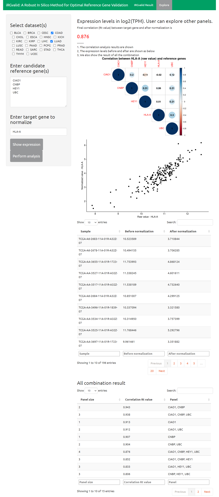

# iRGvalid: A Robust In Silico Method for Optimal Reference Gene Validation

iRGvalid provides an easy and robust method to validate and identify the most stable reference gene or genes from a pool of candidate reference genes. The inclusivity of large expression data sets and direct comparison of candidate reference genes makes it possible to identify reference genes with universal quality. This method can be used in any other gene expression studies when large cohorts of expression data are available.

Please refer https://www.frontiersin.org/articles/10.3389/fgene.2021.716653

doi: 10.3389/fgene.2021.716653


# Online resource

Availible online: [https://wlake.shinyapps.io/iRGvalid/](https://wlake.shinyapps.io/iRGvalid/)



# Run in local

```
git clone https://github.com/ProfessionalFarmer/iRGvalid.git
cd iRGvalid
Rscript app.R
```
# Updates

20200930: Add SKCM project


